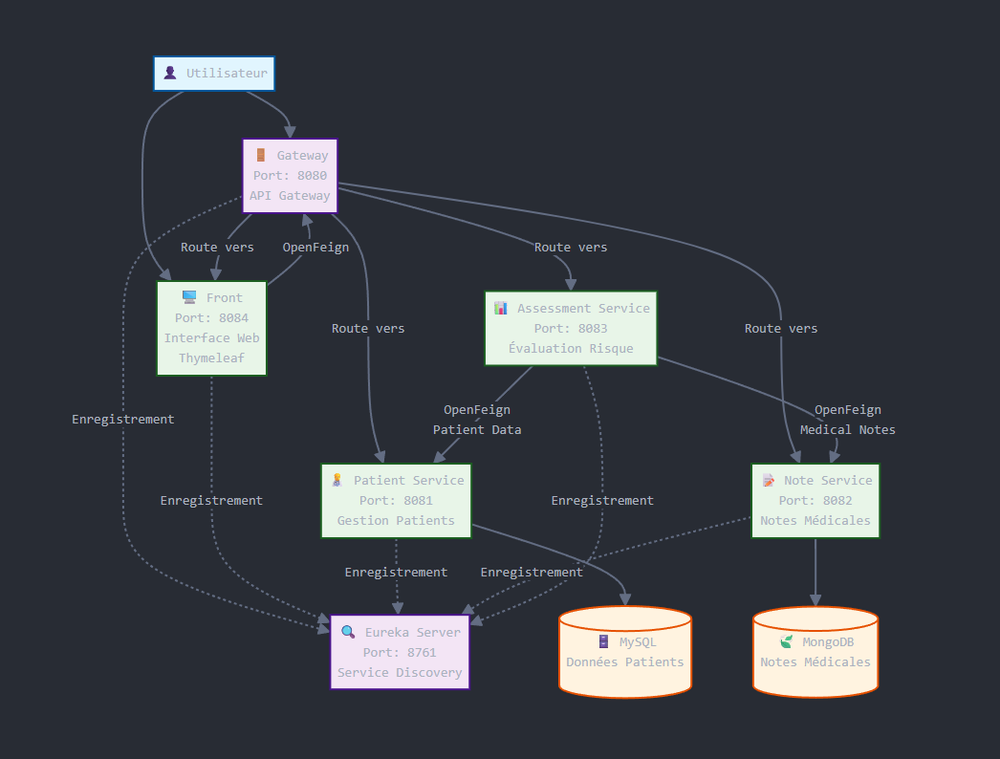
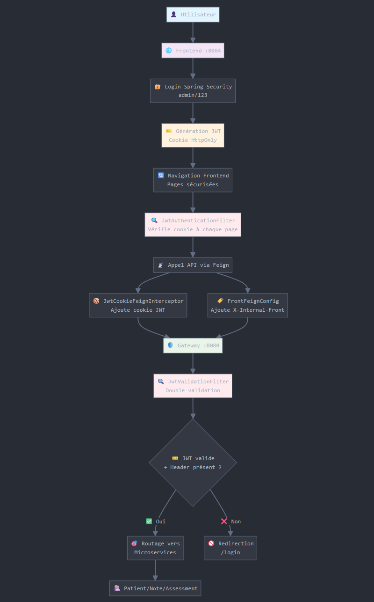
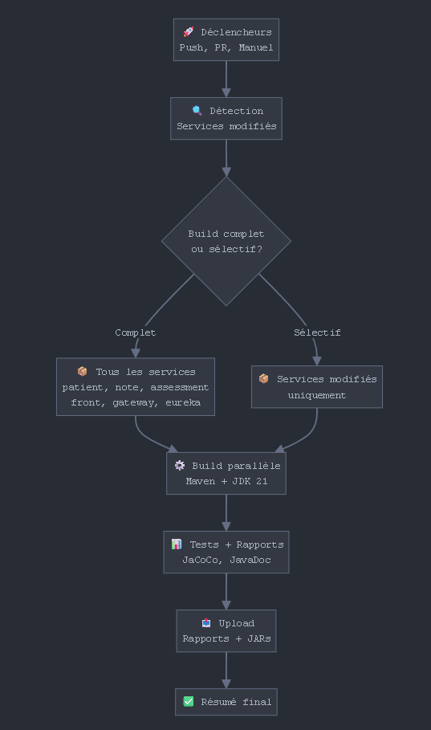
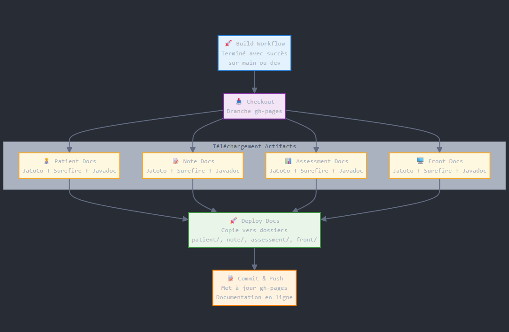
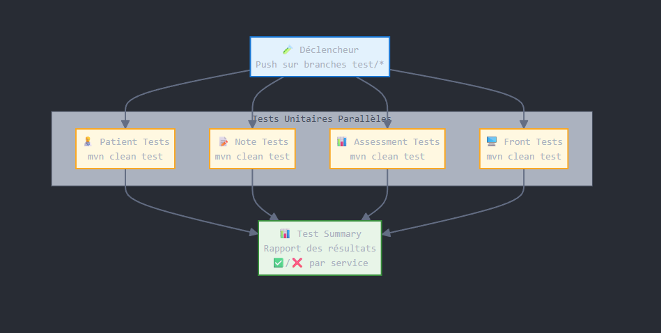
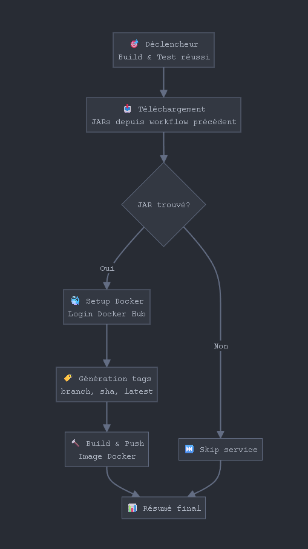

## 📋 Description

Medilabo Solutions est une application de gestion médicale basée sur une architecture microservices. Cette application permet la gestion des patients, de leurs notes médicales et l'évaluation du risque diabétique.

## 📚 Documentation

La documentation technique du projet est disponible à l'adresse suivante :

**🔗 [Documentation Technique](https://fraigneau.github.io/Fraigneau-Lucas-P9-java/)**

Cette documentation contient pour chaque service (patient, note, assessment, front) :
- **Rapports JaCoCo** - Couverture de code des tests
- **Rapports Surefire** - Résultats des tests unitaires  
- **Javadoc** - Documentation du code source# Medilabo Solutions - Microservices Application

## 🏗️ Architecture Microservices

L'application suit les principes de l'architecture microservices avec une séparation claire des responsabilités :



### Service Discovery Pattern
- Utilisation de **Netflix Eureka** pour la découverte automatique des services
- Enregistrement et découverte dynamique des instances

### API Gateway Pattern
- **Gateway** centralisé pour le routage et la gestion des requêtes
- Point d'entrée unique pour tous les clients

### Database per Service Pattern
- Chaque microservice possède sa propre base de données
- **MySQL** pour les données relationnelles (patients)
- **MongoDB** pour les données non-relationnelles (notes médicales)

### Communication inter-services
- **OpenFeign** pour les appels REST synchrones
- Communication basée sur HTTP/REST

### Services

- **eureka** (Port 8761) - Service de découverte et registre des services
- **gateway** (Port 8080) - Passerelle API pour le routage des requêtes
- **patient** (Port 8081) - Gestion des données patients (MySQL)
- **note** (Port 8082) - Gestion des notes médicales (MongoDB)
- **assessment** (Port 8083) - Évaluation du risque diabétique
- **front** (Port 8084) - Interface utilisateur web (Thymeleaf)

## 🛠️ Technologies Utilisées

### Backend
- **Java 21**
- **Spring Boot 3.5.0**
- **Spring Cloud 2025.0.0**
- **Spring Data JPA** (Patient)
- **Spring Data MongoDB** (Note)
- **Netflix Eureka** (Service Discovery)
- **OpenFeign** (Communication inter-services)
- **MapStruct** (Mapping DTO/Entity)

### Frontend
- **Thymeleaf**
- **Bootstrap 5.3.0**
- **HTML5/CSS3**

### Bases de données
- **MySQL** (Service Patient)
- **MongoDB** (Service Note)

### Outils de build et test
- **Maven 3.9.10**
- **JUnit 5**
- **Mockito**
- **JaCoCo** (Couverture de code)

## 📁 Structure du projet

```
medilabo-solutions/
├── eureka/          # Service de découverte
├── gateway/         # Passerelle API
├── patient/         # Microservice Patient
├── note/            # Microservice Note
├── assessment/      # Microservice Assessment
└── front/           # Interface utilisateur
```

## ⚙️ Prérequis

- Java 21+
- Maven 3.6+
- MySQL 8.0+
- MongoDB 4.4+
- Git

## 🚀 Installation et Démarrage

### 1. Cloner le repository
```bash
git clone https://github.com/fraigneau/Fraigneau-Lucas-P9-java medilabo-solutions &&
cd medilabo-solutions
```

### 2. Configuration des bases de données

#### MySQL (Service Patient)
```sql
CREATE DATABASE medilabosolutions_patient;
```

#### MongoDB (Service Note)
```bash
use medilabosolutions_note;
```

### 📊 Données de test

Les données de test sont disponibles dans les dossiers suivants :

- **MySQL** : Scripts SQL dans `patient/data/` pour l'initialisation de la base de données patients
- **MongoDB** : Scripts JavaScript dans `note/data/` pour l'initialisation des notes médicales

Ces fichiers permettent de configurer rapidement les bases de données avec des données d'exemple pour tester l'application.

### 3. Variables d'environnement

Créer un fichier `.env` dans chaque service avec les variables nécessaires :

#### Patient Service
```env
DB_URL=jdbc:mysql://localhost:3306/medilabosolutions_patient
DB_USERNAME=your_username
DB_PASSWORD=your_password
```

#### Note Service
```env
DB_URI=mongodb://localhost:27017/medilabosolutions_note
```

## 🔐 Sécurité

L'architecture de sécurité repose sur une **double validation JWT** entre le microservice Frontend et le Gateway.

### Flux de sécurité
1. **Authentification** → Spring Security valide `admin`/`123`
2. **JWT généré** → Stocké dans cookie HttpOnly par le frontend
3. **Navigation** → `JwtAuthenticationFilter` valide le cookie à chaque page
4. **Appel API** → Feign ajoute automatiquement JWT + header `X-Internal-Front`
5. **Gateway** → Double validation (JWT + header) avant routage

### Mécanismes de protection
- **Cookie HttpOnly** : Protection XSS
- **Header X-Internal-Front** : Identification requêtes légitimes
- **Double validation** : Frontend + Gateway
- **Clé secrète partagée** : `jwt.secret` commune



## 🌐 Endpoints

### Gateway (Port 8080)
- Patient API : `/api/patient/**`
- Note API : `/api/note/**`
- Assessment API : `/api/assessment/**`
- Frontend : `/home`, `/patient/**`, `/notes/**`

### Eureka Dashboard
- URL : `http://localhost:8761`

### Application Web
- URL : `http://localhost:8084/home`

## 📊 Monitoring et Santé

Chaque service expose des endpoints Actuator :
- Health : `/actuator/health`
- Info : `/actuator/info`

## 🔄 Workflows

Le projet utilise GitHub Actions pour l'intégration continue avec deux workflows principaux :

- **Validation des tests** : Exécution automatique des tests unitaires sur les branches de développement
- **Déploiement de la documentation** : Publication automatique des rapports JaCoCo, Surefire et Javadoc sur GitHub Pages







## 📝 API Documentation

### Patient Service
- `GET /api/patient` - Liste tous les patients
- `GET /api/patient/page` - Liste paginée des patients
- `GET /api/patient/{id}` - Récupère un patient par ID
- `POST /api/patient` - Crée un nouveau patient
- `PUT /api/patient/{id}` - Met à jour un patient
- `DELETE /api/patient/{id}` - Supprime un patient

### Note Service
- `GET /api/note/{patId}` - Récupère les notes d'un patient
- `POST /api/note` - Crée une nouvelle note

### Assessment Service
- `GET /api/assessment/{patId}` - Évalue le risque diabétique d'un patient

## 🔧 Configuration

### ⚡ Ordre de démarrage

Pour un fonctionnement optimal en local, il est essentiel de respecter l'ordre de démarrage suivant :

1. **Eureka Server** (Port 8761) - Doit être démarré en premier pour permettre la découverte des services
2. **Services métier** (Ports 8081-8084) - Peuvent être lancés en parallèle une fois Eureka opérationnel
3. **Gateway** (Port 8080) - Doit être démarré en dernier pour que tous les services soient disponibles lors du routage

Cette séquence garantit que chaque service peut s'enregistrer correctement auprès d'Eureka et que le Gateway peut découvrir tous les services disponibles.
### Ports par défaut
- Eureka : 8761
- Gateway : 8080
- Patient : 8081
- Note : 8082
- Assessment : 8083
- Front : 8084

# 🐳 Déploiement avec Docker Compose

Cette section décrit l'architecture et le déploiement de l'application MedilaboSolutions utilisant Docker Compose.

## 🌐 Réseau et Communication

Tous les services communiquent via un **réseau Docker bridge** dédié (`medilabosolutions-net`), permettant :
- Communication inter-services par nom de service
- Isolation du trafic réseau
- Résolution DNS automatique

## 🔧 Configuration

### Variables d'environnement requises

Créez un fichier `.env` à la racine du projet avec les variables suivantes :

```env
# Registry Docker
REGISTRY=docker.io
IMAGE_OWNER=votre-username-docker
TAG=latest

# Base de données MySQL
MYSQL_USER=medilabo_user
MYSQL_PASSWORD=votre-mot-de-passe

# Base de données MongoDB
MONGO_ROOT=admin
MONGO_PASS=votre-mot-de-passe-mongo

# Sécurité JWT
JWT_SECRET=votre-clé-secrète-jwt
JWT_EXPIRATION=86400000
```

### Volumes persistants

Les données sont persistées via des volumes Docker :
- `mysql-data` - Données MySQL
- `mongo-data` - Données MongoDB

## 🚀 Démarrage

### Prérequis
- Docker Engine 20.10+
- Docker Compose v2+
- Fichier `.env` configuré

### Commandes

```bash
docker compose up -d

docker compose ps

docker compose logs -f [service-name]

docker compose down
```

## 🔍 Health Checks

Chaque service inclut des **health checks automatiques** :
- **Intervalles** : 15-20 secondes
- **Timeout** : 10 secondes  
- **Retry** : 10 tentatives
- **Endpoints** : `/actuator/health` pour les services Spring Boot

## 📋 Ordre de démarrage

Les services démarrent dans l'ordre suivant grâce aux dépendances :

1. **MySQL** & **MongoDB** (bases de données)
2. **Eureka Server** (service registry)
3. **Patient**, **Note**, **Assessment** (services métier)
4. **Gateway** (API Gateway)
5. **Front-end** (interface utilisateur)

## 🌍 Accès aux services

Une fois déployé, l'application est accessible via :

- **Interface utilisateur** : http://localhost:8084
- **API Gateway** : http://localhost:8080
- **Eureka Dashboard** : http://localhost:8761

## ⚠️ Notes importantes

- Les **health checks** garantissent que les services dépendants attendent leur disponibilité
- Les **données initiales** sont chargées automatiquement depuis `./patient/data` et `./note/data`
- La **configuration Eureka** permet la découverte automatique des services
- Le **JWT** est partagé entre les services pour l'authentification

## 👥 Auteur

**Fraigneau Lucas**
